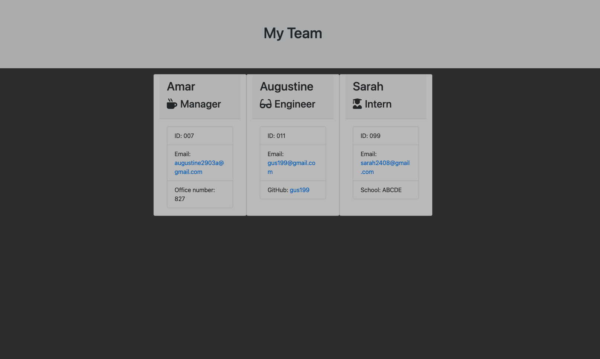
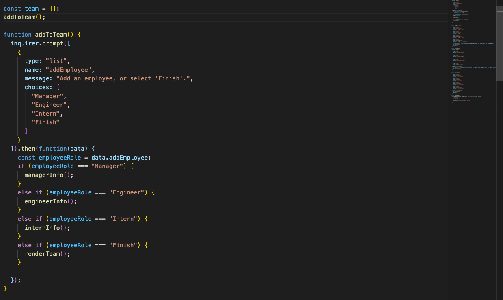
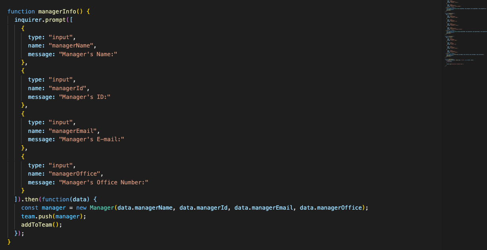
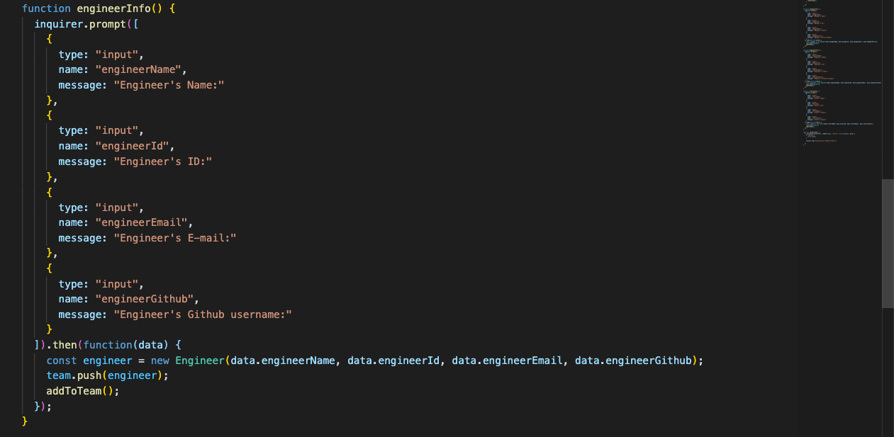
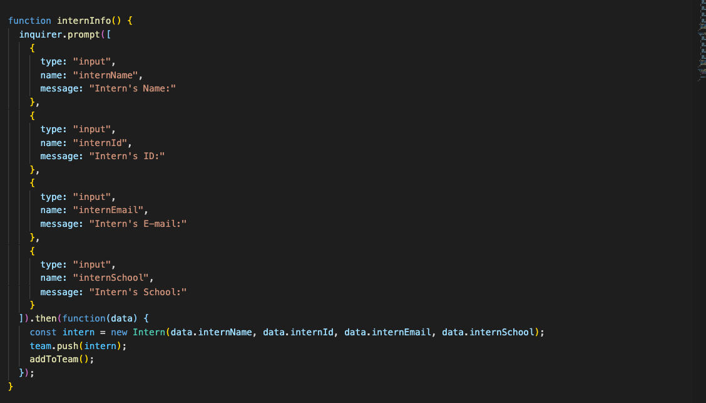

# Team-Profile-Generator 
## Table of Contents 

* Project Description
* Installation
* Usage
* Contributing 
* Demo Video
* Questions ?
* Screenshot

## Description
This application is a Team Profile generator that can be utilized through node.js. The user is prompted to select a type of employee to add, then prompted with a series of information input related to the chosen employee type. Once all the employees are added, selecting "Finish" will create an HTML page with consisting of team profile cards with the input information.

## Instalation

In Command prompt type “npm init -y” to initialized then “npm i inquirer” to install the required “Inquirer package”.

## Usage 

Run index.js in command line and the user will be prompted to add an employee type, or select "Finish". Choosing an employee type will prompt the user to input information about that employee. After all the inputs, the user will be re-prompted to select another employee type or "Finish". The user can add as many employee types as needed. Upon selecting "Finish", an HTML page, "team.html", will be added to an "output" directory.

Employee types in this application:

* Manager
* Engineer
* Intern

## Contributting
A work in progress. And the possibilities are endless.
Please feel free to submit any code updates for review and acceptance.

* 

## Project Demo Video

* 

## Questions

Please feel free to ask me anyquestions:
* If you have any questions about the repo, open an issue or contact directly augustine2903a@gmail.com.
* 

## Screenshot

